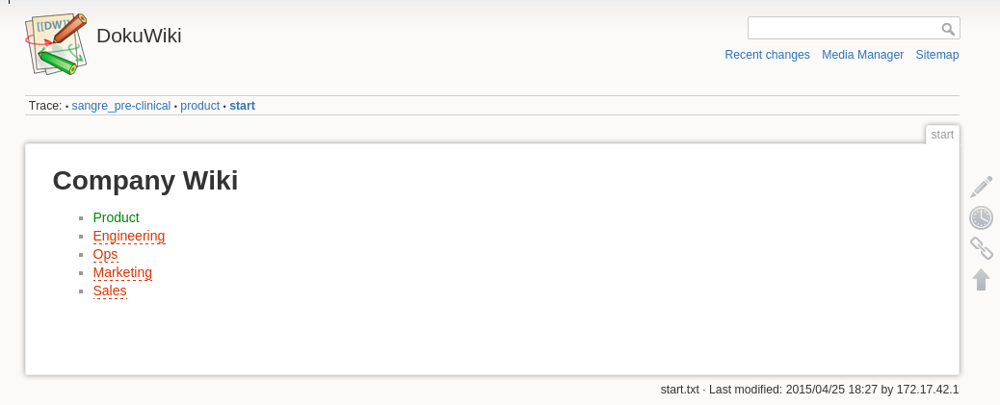

# DokuWiki with Docker

Based on https://github.com/istepanov/docker-dokuwiki

## Setup on laptop

    sudo sh -c "echo '127.0.0.1 laptop-wiki.company.com' >> /etc/hosts"
    bin/build or bin/build_no_ssl

## Run

    bin/run

Open [http://laptop-wiki.company.com](http://laptop-wiki.company.com)

## Stop

    bin/rm

## Backup

   bin/backup
   
It creates a file named dokuwiki-backup-2015-04-25.tar.gz

## Restore

    bin/restore YYYY-MM-DD   # pass the date which is part of the backup file. for example: bin/restore 2015-04-25

## Setup on production server

    digital ocean box, 10GB, docker

    ssh root@104.236.135.240 -i ~/.ssh/digital-dev
    echo "export HOST=wiki.company.com" > /etc/environment
    adduser developer
    password: dev 
    visudo
    developer ALL=(ALL:ALL) ALL 
    sudo adduser developer docker (so you don't need sudo to use docker)
    login developer
    mkdir .ssh
    touch .ssh/authorized_keys
    add .ssh/digital-dev.pub key to authorized_keys (for password-less login)
    scp ~/.ssh/ci developer@some-ip:.ssh/ (for pulling from github)
    ssh developer@some-ip -i ~/.ssh/digital-dev
    git clone https://oauth-token@github.com/company/wiki.git
    bin/build
    bin/run
